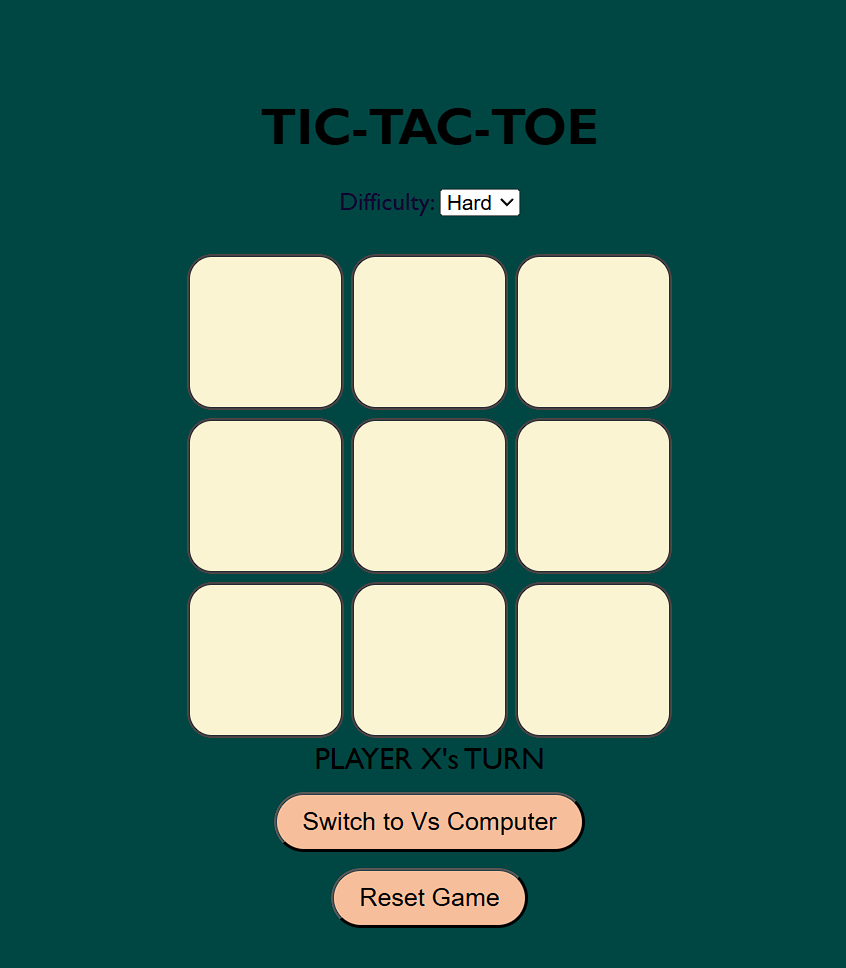

# 🎮 Tic Tac Toe Game

A fun and interactive Tic Tac Toe game built using HTML, CSS, and JavaScript.  
It supports both **2 Player** mode and **Player vs Computer** mode with two difficulty levels.

## 🚀 Features
- ✅ 2 Player mode
- 🤖 Play vs Computer (Easy & Hard)
- 🧠 AI uses Minimax algorithm in Hard mode
- 🌟 Highlights the winning combination
- 🎨 Clean, responsive UI

## 🛠️ Technologies Used
- HTML5
- CSS3
- JavaScript (Vanilla)
- Minimax Algorithm (for AI)

## ▶️ How to Play
1. Open `index.html` in your browser.
2. Choose the game mode using the toggle.
3. For AI mode, select difficulty.
4. Click on cells to make your move!

## 🧠 AI Details
The hard difficulty uses the **Minimax algorithm** to simulate all possible outcomes and pick the best move for the computer.

## 📁 Project Structure
├── index.html
├── style.css
├── script.js
├── README.md
└── assets/
## 📸 Screenshot

## 📌 Future Improvements
- Add sound effects
- Make it mobile-friendly
- Add scoring system

## 📜 License
This project is open source and available under the [MIT License](LICENSE).

