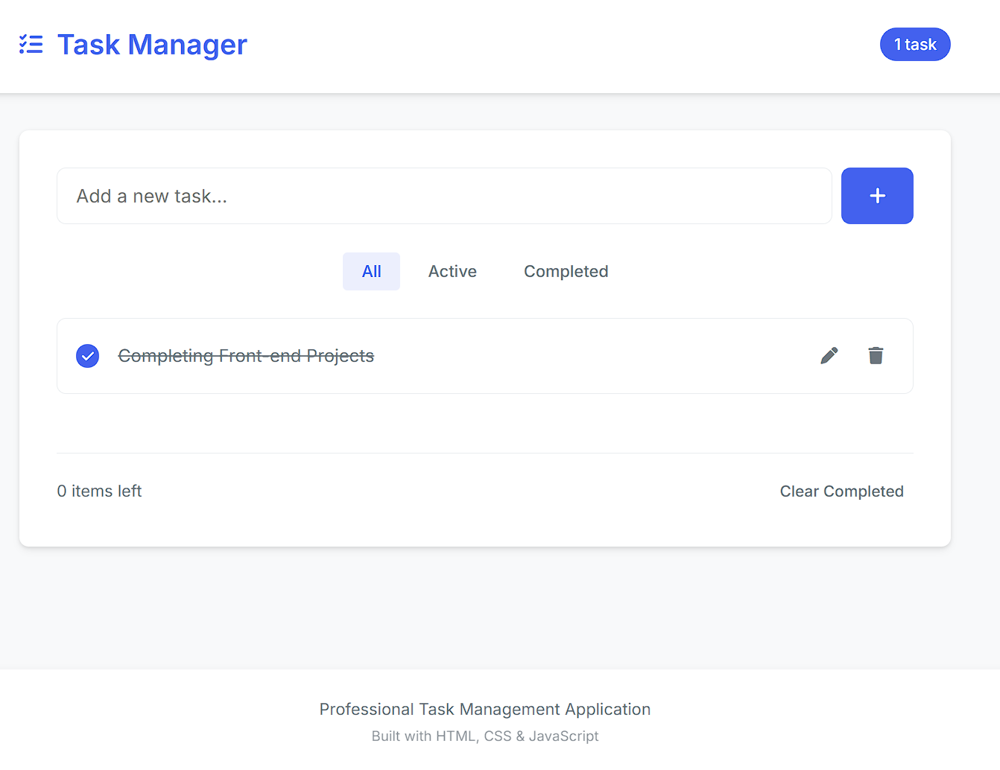

# 📝 Professional Task Manager  

  
*Clean, modern task management interface*

---

## ✨ Features  

### 🎯 Core Functionality  
✔ **Add/edit/delete** tasks with intuitive controls  
✔ **Mark tasks complete** with visual feedback  
✔ **Filter tasks** (All/Active/Completed)  
✔ **Persistent storage** using localStorage  

### 📊 Visual Indicators  
🔢 Task counters (total/remaining)  
✅ Strikethrough for completed items  
📭 Empty state illustrations  
🎨 Professional color scheme  

### 🛠 Technical Highlights  
⚡ Pure client-side implementation  
📱 Fully responsive design  
🌈 CSS variables for easy theming  
♿ Accessible interface  

---

## 🚀 Quick Start  

🎨 UI Components
    graph TD
    A[Header] --> B[Task Input]
    A --> C[Task Counter]
    B --> D[Task List]
    D --> E[Task Item]
    E --> F[Checkbox]
    E --> G[Task Text]
    E --> H[Action Buttons]
    D --> I[Empty State]
    A --> J[Filter Controls]
    D --> K[Footer Stats]

📂 Project Structure

    professional-todo-app/
├── 📄 index.html          # Main application
├── 🎨 style.css           # All styles
├── ⚙️ script.js           # Core logic
├── 📸 screenshot.png      # App preview
└── 📜 README.md           # Documentation
